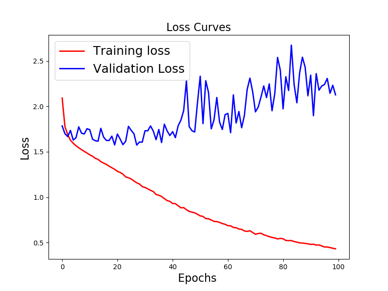
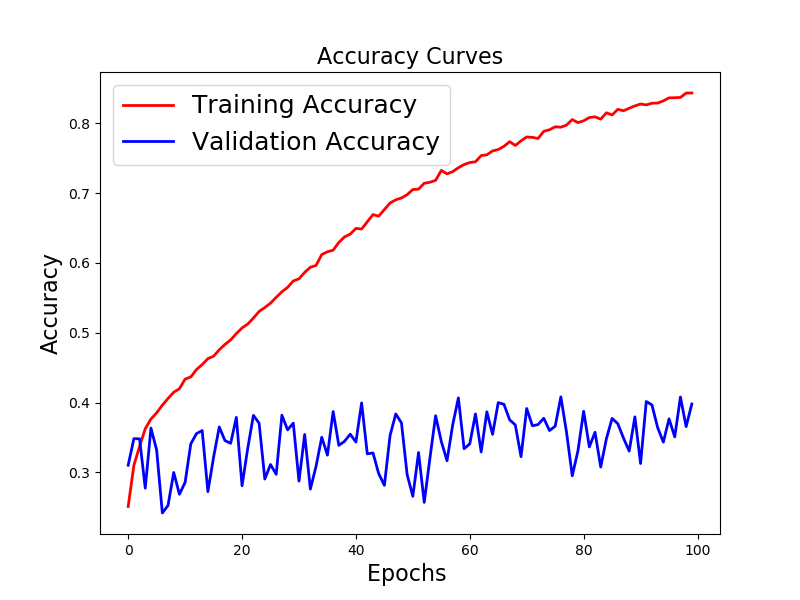

# Homework 3

## Purpose: Image Sentiment Classification

本次作業為人臉表情情緒分類，總共有七種可能的表情（0：生氣, 1：厭惡, 2：恐懼, 3：高興, 4：難過, 5：驚訝, 6：中立(難以區分為前六種的表情))。

## Data 簡介

* training dataset 為兩萬八千張左右 48x48 pixel的圖片，以及每一張圖片的表情 label（注意：每張圖片都會唯一屬於一種表情）。

* Testing dataset 則是七千張左右 48x48 的圖片

* 如下圖，由左至右依序為生氣、厭惡、恐懼、高興、難過、驚訝、中立

* 各類別數量
<table style="width:50%">
  <tr>
    <td>**0：生氣** </td> 
    <td> 3995 </td> 
  </tr>
  
  <tr>
    <td>**1：厭惡**</td>
    <td> 436 </td> 
  </tr>
  
  <tr>
    <td>**2：恐懼**</td>
    <td> 4097 </td> 
  </tr>

  <tr>
    <td>**3：高興**</td>
    <td> 7215 </td> 
  </tr>

  <tr>
    <td>**4：難過**</td>
    <td> 4830 </td> 
  </tr>

  <tr>
    <td>**5：驚訝**</td>
    <td> 3171 </td> 
  </tr>

  <tr>
    <td>**6：中立**</td>
    <td> 4965 </td> 
  </tr>
  
</table>

## Summary 總結

本次作業利用 training dataset 訓練一個 CNN model，預測出每張圖片的表情 label（同樣地，為 0~6 中的某一個)，並跟參數個數差不多的 DNN model 去進行比較。

在資料處理的部分，先將 training data 進行標準化，並取出最後 5000 資料當作 validation data (大約 20% 資料量)。

首先 CNN model 模型架構如圖下所示，

模型總參數數量為 4,183,815，其中有 3968 個是 BatchNormalization() 的 non-trainable 個數。

在 CNN model 訓練過程中，可以觀察到大約在 20 個 epoch 左右，validation loss 來到了低點，validation accuracy 似乎也到了極限 (63.86%)。在 20 個 epoch 之後 validation accuracy 只有稍為的提升，最好的 validation accuracy 為 66.16% 。

DNN model 模型架構如圖下所示，

模型總參數數量為 4,478,983，其中有 6,144 個是 BatchNormalization() 的 non-trainable 個數。

在 DNN model 訓練過程中，我觀察到與 CNN model 差異點有:

- DNN model 的 validation accuracy 完全無法跟 CNN model 相比。
- 訓練速度上 DNN model 速度完勝於 CNN model 。 DNN model 一個 epoch 大約 20sec 而 CNN model 約 200sec。個人猜測主要原因為 Convolution 需要消耗比較多的運算。
- 在 validation loss 部分似乎不是很樂觀，在 40 個 epoch 之後甚至有上升的趨勢。

### 心得:

在做這份作業的過程中，如果沒有將pixel除以255，模型訓練效果會非常差，主要原因是因為沒有除以255導致模型訓練速度過慢，在沒有良好的設備和時間的情況下，結果都不會太優。而除以255之後pixel數值會分布在0~1之間，這樣可以加速模型的訓練，以至於在同樣的模型相同的鉉練次數結果會差很多。###要在驗證

隨著 Convolution 越來越多層，模型在訓練集的預測正確率可以高達90%以上，但在驗證集始終無法突破 55% 的預測正確率，這現象意味著模型過擬和訓練資料。面對這樣的問題我們採用 droupout 來抑制過擬合現象，首先在 fully connection 的部分採用 droupout，在驗證集的表現似乎有提升 3% ~ 5% 左右，但就是過不了 60% 。隨著 droupout 的強度越來越強，甚至對 Convolution 也進行 droupout 的過程中我們也可以發現在驗證集的正確預測率可以達到 65% 。

1. 照片需要除255 效果影響很大 50%以下

2. 3 個 conv + 2-3個 fc vail data ~50%~55%

3. 4 個 conv + 2-3個 fc vail data ~55%~60% basic droupout 0.2 on fc

4. 4 個 conv + 2-3個 fc vail data ~57%~63% basic droupout 0.2 on all layer                     15epoch

5. 4 個 conv + 2-3個 fc vail data ~60%~65% basic droupout 0.5 on fc layer 0.2 0.3 0.3 onconv   20epoch

## Reference

* [原始課程作業說明](https://docs.google.com/presentation/d/1QFK4-inv2QJ9UhuiUtespP4nC5ZqfBjd_jP2O41fpTc/edit?ts=58e452ff#slide=id.p)

