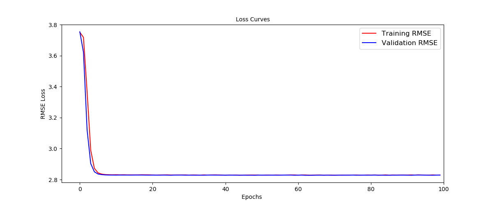
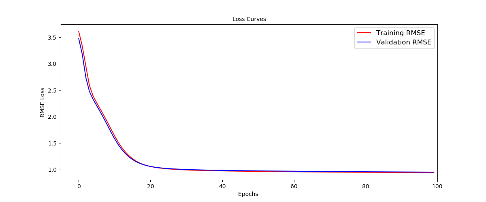
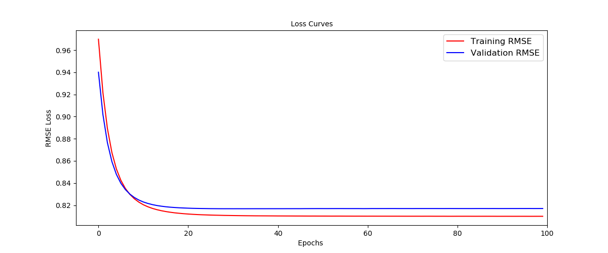

# Homework 5

## Purpose: Predict movie ratings

本次作業主要目標是利用 User 對 Movie 的歷史評分去預測 User 未曾觀看過 Movie 的評分。

- 下表為 User A 到 E 對 Movie 1 到 4 的評分，本次目標就是利用這些已知評分去預測 ? 的部分。
  

<table style="width:80%">
  <tr>
    <td> </td> 
    <td> Movie 1 </td>
    <td> Movie 2 </td> 
    <td> Movie 3 </td> 
    <td> Movie 4 </td> 
  </tr>
  
  <tr>
    <td>User 1</td>
    <td> 5 </td> 
    <td> 3 </td> 
    <td> ? </td> 
    <td> 1 </td> 
  </tr>
  
  <tr>
    <td>User 2</td>
    <td> 4 </td> 
    <td> 3 </td> 
    <td> ? </td> 
    <td> 1 </td> 
  </tr>

  <tr>
    <td>User 3</td>
    <td> 1 </td> 
    <td> 1 </td> 
    <td> ? </td> 
    <td> 5 </td> 
  </tr>

  <tr>
    <td>User 4</td>
    <td> 1 </td> 
    <td> ? </td> 
    <td> 4 </td> 
    <td> 4 </td> 
  </tr>

  <tr>
    <td>User 5</td>
    <td> ? </td> 
    <td> 1 </td> 
    <td> 5 </td> 
    <td> 4 </td> 
  </tr>
</table>

主要以 matrix factorization 的方法去預測 User-Movie matrix 的遺失值。下列利用一個簡單的例子來做說明。

- matrix factorization 的概念為，將上列表格式為一個 User-Movie matrix，並利用 svd 矩陣分解的概念將 User-Movie matrix 拆解成 User matrix 和 Movie matrix。

- 首先假設 u 個 User、m 部 Movie、d 個 latent factor、User-Movie matrix 為 、User matrix 為 、Movie matrix 為 。如下圖所示。

  

- 由於 User-Movie matrix 中存在遺失值，所以我們利用已知的評分去計算 loss function

   

## Data 簡介

* Training dataset 為 899873 筆資料，其中包含 6040 位 User 和 3688 部電影。

* Testing dataset 則是 100336 筆資料， 其中一半為 kaggle private set。

## Summary

在這次大約 90 萬筆 Training dataset 裡面，我們將最後面 8 萬筆資料當作 validation set。

一開始我們從最基本的 matrix factorization 出發，模型結構如下圖，模型參數 311,296 個。

接下來我們增加模型的複雜度，在 User 和 Movie 分別增加 bias 項，模型參數 321,024 個。

* 比較有無 Bias 項訓練的結果。
   * latent factor 為 32
   * Batch Size 為 4096
   * dropout 為 0.3
   * L2 regularizer 0.01
   
<table style="width:80%">
  <tr>
    <td> </td> 
    <td> Training Loss </td>
    <td> Training RMSE </td> 
    <td> Valid Loss </td> 
    <td> Vaild RMSE </td> 
  </tr>
  
  <tr>
    <td>unBias</td>
    <td> 2.4846 </td> 
    <td> 1.5762 </td> 
    <td> 1.4903 </td> 
    <td> 1.2206 </td> 
  </tr>

  <tr>
    <td>Bias</td>
    <td> 0.8613 </td> 
    <td> 0.9279 </td> 
    <td> 0.8775 </td> 
    <td> 0.9367 </td> 
  </tr>
</table>

下圖(左)為無 Bias 項的 MF，由 loss curves 可以得知模型大約在第 10 個 epoch 就已經收斂，RMSE 已經無法低於 2.8。下圖(右)為增加 Bias 項的 MF，增加 Bias 項提高模型的複雜度，使模型可以捕捉到更多訊息，這點可以在 loss curves 得知。RMSE 也由 2.8 降至 0.9，但也因為模型複雜度增加，模型大約到了第 40 個 epoch 才收斂。

進一步解釋增加 Bias 項所帶來的效益，我們可以直觀的解釋成，每個 user 和 movie 對於 rate 都有不同的分布。更直觀的說就是 user 1 再給 rate 的時候可能以3分為基準，喜歡的電影就給4分，不喜歡則給2分，user 2 可能會是喜歡給5分，不喜歡給1分。增加 Bias 項，可以幫助模型捕捉到 user 之間對於給分傾向的差異，movie 的解釋也是雷同。

    
    

* 在模型有 Bias 項的情況下，比較有無 normalize(在 rating 上) 的差別。
   * latent factor 為 32
   * Batch Size 為 4096
   * dropout 為 0.3
   * L2 regularizer 0.01

<table style="width:80%">
  <tr>
    <td> </td> 
    <td> Training Loss </td>
    <td> Training RMSE </td> 
    <td> Valid Loss </td> 
    <td> Vaild RMSE </td> 
  </tr>
  
  <tr>
    <td>unNormalize</td>
    <td> 0.8613 </td> 
    <td> 0.9280 </td> 
    <td> 0.8775 </td> 
    <td> 0.9367 </td> 
  </tr>

  <tr>
    <td>Normalize</td>
    <td> 0.6363 </td> 
    <td> 0.7976 </td> 
    <td> 0.6389 </td> 
    <td> 0.7993 </td> 
  </tr>
</table>

    
    

最後我們嘗試使用 DNN 的方法來比較一般的 MF 和 DNN 之間的差異。模協結構如下圖所示。

* 

*  比較不同的 latent dimension 的結果。

* bias + normal droupout 要調高才會訓練的好

## File Stucture

## Reference

* [原始課程作業說明](https://docs.google.com/presentation/d/10a1ET-9m3ntQhGesxCpQOqPtab4ldUBBrq-i3o-h2HE/edit#slide=id.g2b65c05370_1_5)

* [Collaborative filtering in Keras](http://www.fenris.org/2016/03/07/index-html)

* [Recommender Systems in Keras](https://nipunbatra.github.io/blog/2017/recommend-keras.html)
